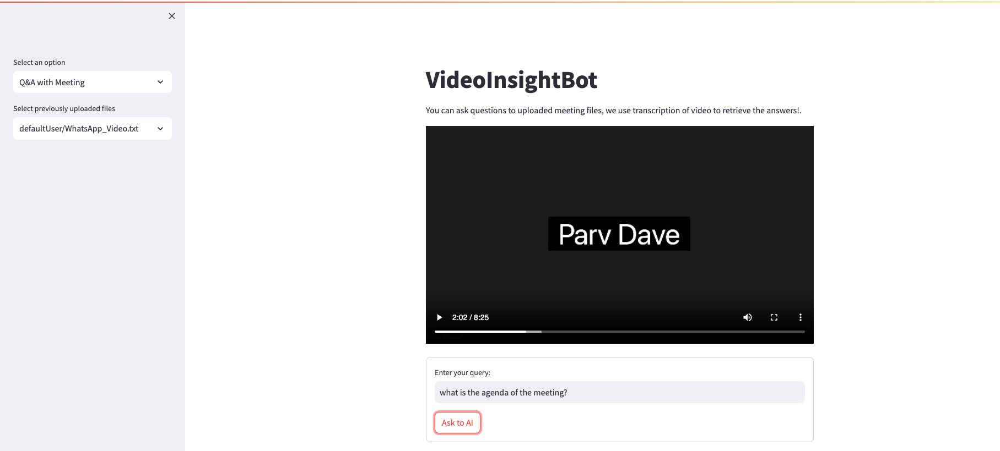
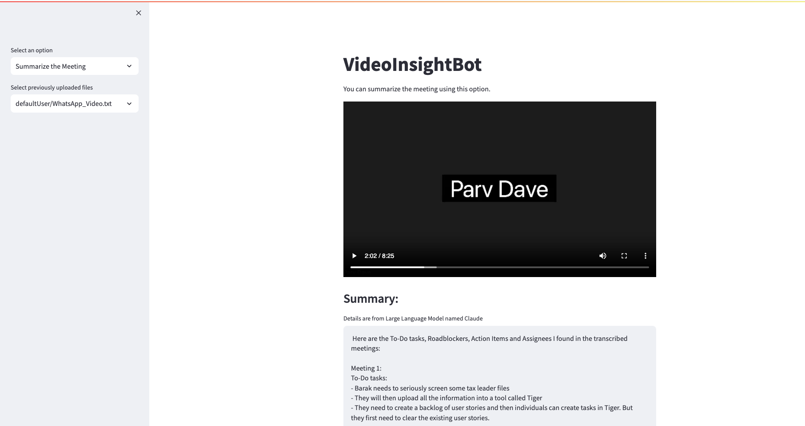

# VideoInsightBot

VideoInsightBot is a Streamlit project with an AWS-hosted backend that leverages the power of AI to transcribe videos, provide quick meeting summaries, and answer questions based on the transcribed content. The project allows to use AWS services such as AWS transcribe for transcription and models such as the Claude Instant hosted on AWS Bedrock for analysis.

## Features

- **Video Transcription:** Upload any video, and the bot will transcribe its content using the AWS Transcribe Service.

- **Meeting Summary:** Receive a quick summary of the meeting and identify action items extracted from the transcribed content.

- **Q&A with LLM:** Ask questions related to the video, and the bot will utilize the transcribed context to provide relevant answers.

- **Backup to S3:** All files, including transcriptions and summaries, are uploaded to AWS S3 for backup and storage purposes.

## Technologies Used

The project incorporates the following services and packages:

- AWS S3 Bucket: Used for storing files and backups.

- Bedrock: Hosts the Claude V2 model for video transcription.

- Langchain: Provides natural language processing capabilities.

- Streamlit: Powers the user interface for seamless interaction.

- Boto3: Interacts with AWS services, including S3.

- Pydub and Moviepy: Used for audio processing and video manipulation.

## Screenshots

- 1. Upload a video

- 2. Analyse a video

- 3. Check History

- 3. Summarize a video

## Live Demo
[Link](http://speechtotext-1823339700.us-east-1.elb.amazonaws.com/)

## Getting Started

To run this repository:

1. Clone the repository to your local machine.
2. Login using AWS CLI.
3. Install dependencies using the `pip install -r requirements.txt` command.
4. Run frontend using `streamlit run frontend.py`.

Now, you're ready to explore the capabilities of VideoInsightBot and enhance your video interaction experience.

Feel free to contribute, report issues, or suggest improvements. Happy video botting!
